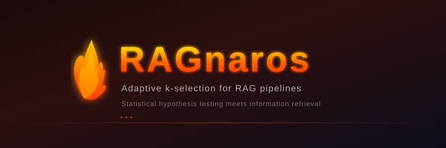
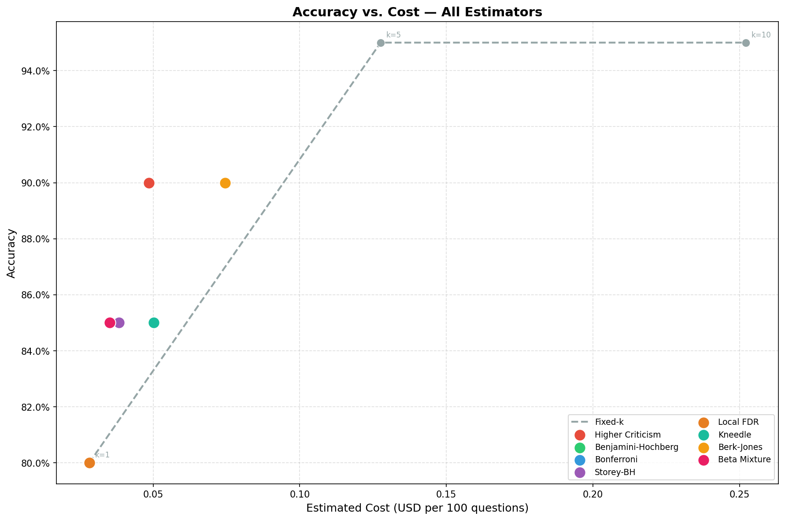
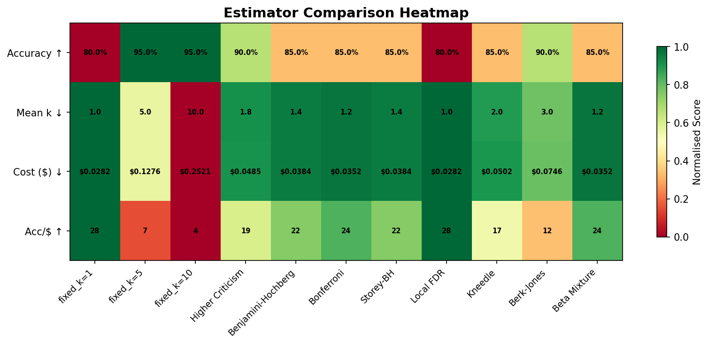
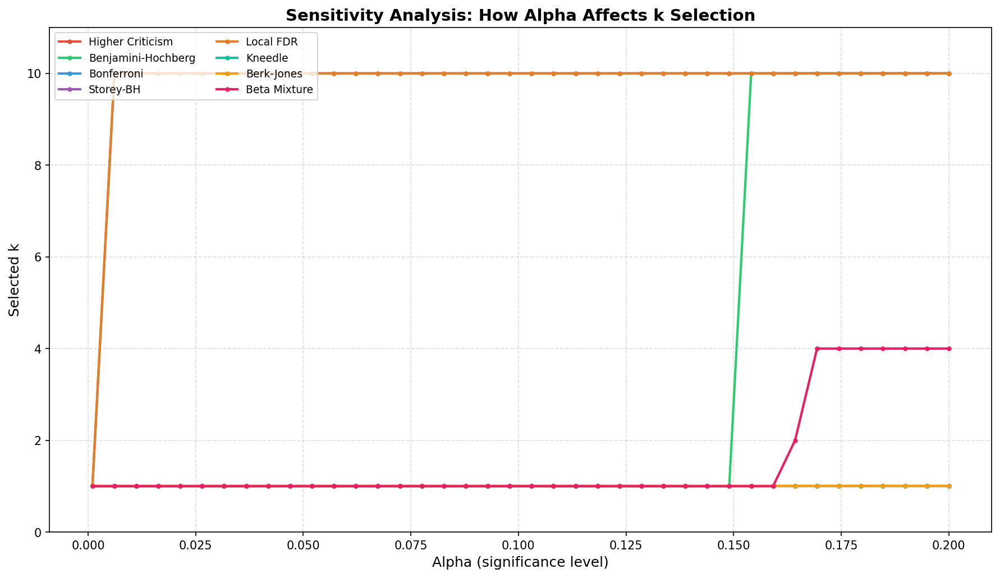
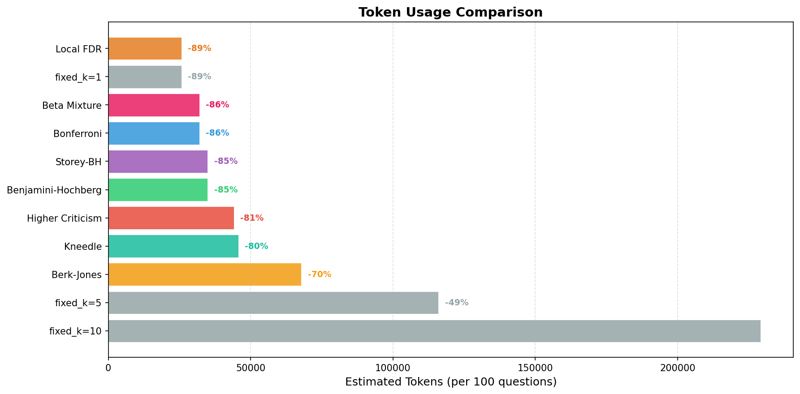
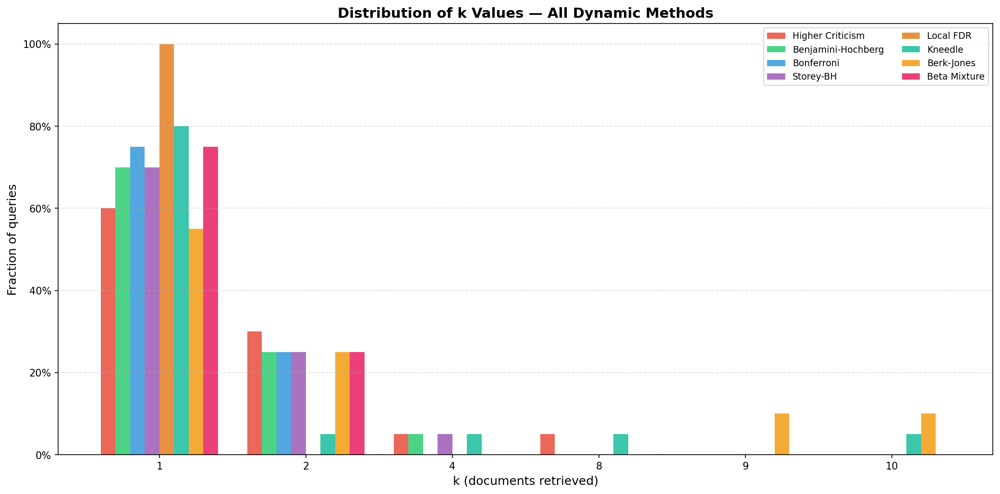
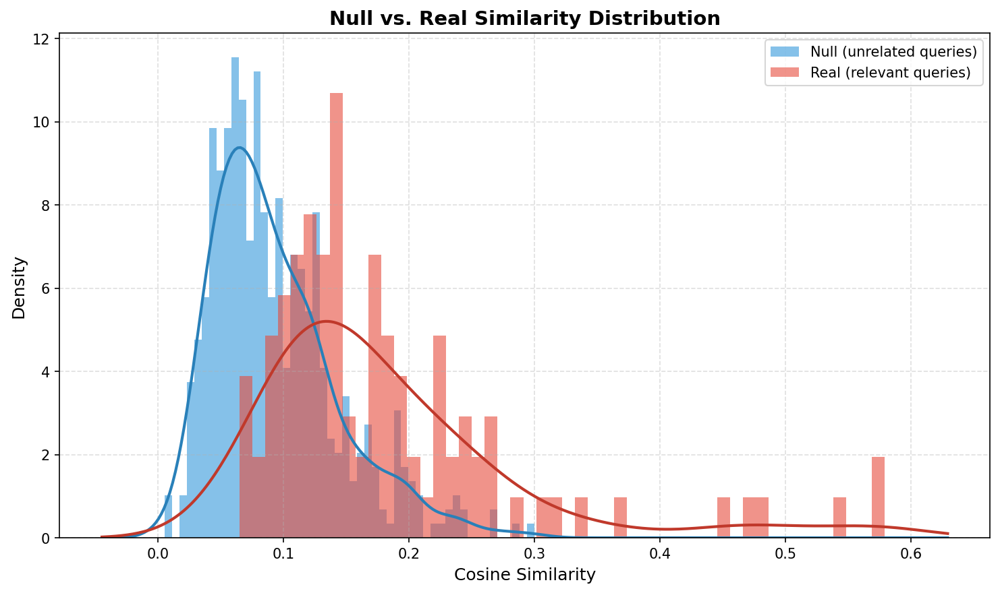
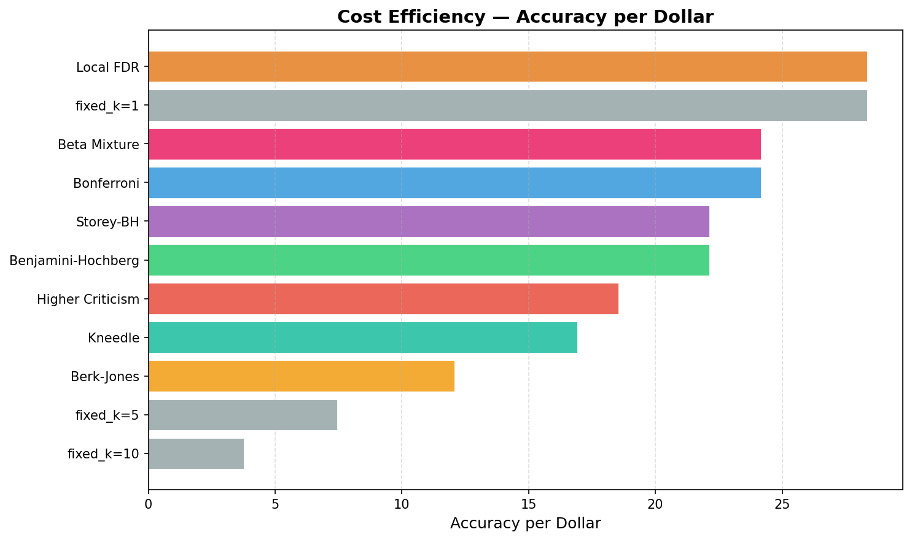
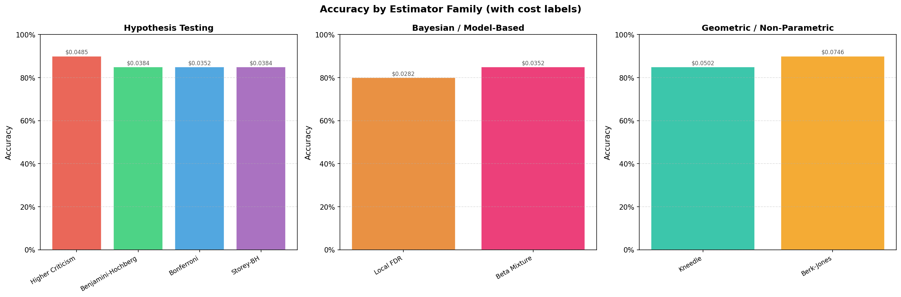

<p align="center">
  
</p>

<p align="center">
  <a href="https://www.python.org/downloads/"></a>
  <a href="https://opensource.org/licenses/MIT"></a>
  <a href="https://pypi.org/project/ragnaros/"></a>
  <a href="https://github.com/YarinShitrit/Ragnaros/actions"></a>
</p>

<p align="center">
  <strong>Adaptive k-selection for RAG pipelines using statistical hypothesis testing</strong>
</p>

<p align="center">
  RAGnaros replaces the fixed <code>k</code> document retrieval parameter in RAG pipelines with a statistically-grounded dynamic selection.<br/>
  Instead of blindly fetching a constant number of documents per query, it estimates how many documents are <em>actually needed</em> — reducing token usage and cost while maintaining or improving answer quality.
</p>

---

## Why RAGnaros?

Standard RAG systems retrieve a fixed number of documents `k` for every query, regardless of how complex or simple the question is. This creates two failure modes:

- **Over-retrieval** — simple queries fetch 10 documents when 1 would suffice, wasting tokens and increasing cost.
- **Under-retrieval** — complex multi-hop questions need more context than a conservative fixed `k` provides.

RAGnaros solves this by treating each query as a statistical hypothesis test: *are there significantly more relevant documents than background noise in this corpus?*

---

## 8 Estimators — From 3 Research Methods to a Comprehensive Toolkit

RAGnaros v0.2 includes **8 statistically-grounded estimators** spanning four families of methods:

| Family | Estimator | Method | Key Insight |
|---|---|---|---|
| **Hypothesis Testing** | `higher_criticism` | Donoho & Jin (2004) | Detects sparse signals via max p-value deviation |
| | `benjamini_hochberg` | Benjamini & Hochberg (1995) | Controls False Discovery Rate (FDR) |
| | `bonferroni` | Bonferroni (1936) | Controls Family-Wise Error Rate (FWER) |
| | `storey_bh` | Storey (2002) | Adaptive BH with pi0 estimation — strictly more powerful than BH |
| **Bayesian / Model-Based** | `local_fdr` | Efron (2001) | Per-document posterior probability of relevance |
| | `beta_mixture` | Pounds & Morris (2003) | EM-fitted Beta-Uniform mixture model on p-values |
| **Geometric** | `kneedle` | Satopaa et al. (2011) | Elbow detection on similarity curve — parameter-free |
| **Likelihood Ratio** | `berk_jones` | Berk & Jones (1979) | KL-divergence based goodness-of-fit — dominates Kolmogorov |

### Demo Results (HotPotQA, local embeddings, no API keys needed)

| Method | Accuracy | Mean k | Est. Tokens | Est. Cost | Token Savings vs k=10 | Acc/$ |
|---|---|---|---|---|---|---|
| Fixed k=1 | 80% | 1.0 | 25,658 | $0.028 | -89% | 28.3 |
| Fixed k=5 | 95% | 5.0 | 116,002 | $0.128 | -49% | 7.4 |
| Fixed k=10 | 95% | 10.0 | 229,216 | $0.252 | — | 3.8 |
| **Higher Criticism** | **90%** | **1.8** | **44,122** | **$0.049** | **-81%** | **18.5** |
| **Berk-Jones** | **90%** | **3.0** | **67,831** | **$0.075** | **-70%** | **12.1** |
| Benjamini-Hochberg | 85% | 1.4 | 34,920 | $0.038 | -85% | 22.1 |
| Storey-BH | 85% | 1.4 | 34,920 | $0.038 | -85% | 22.1 |
| Bonferroni | 85% | 1.2 | 31,989 | $0.035 | -86% | 24.2 |
| Beta Mixture | 85% | 1.2 | 31,989 | $0.035 | -86% | 24.2 |
| Kneedle | 85% | 2.0 | 45,644 | $0.050 | -80% | 16.9 |
| Local FDR | 80% | 1.0 | 25,658 | $0.028 | -89% | 28.3 |

**Key findings:**
- **Higher Criticism** and **Berk-Jones** tie for best accuracy (90%), matching fixed k=5 performance while using 81% and 70% fewer tokens respectively
- All dynamic methods achieve 80-90% accuracy while saving 70-89% of tokens vs fixed k=10
- **Local FDR** and **Bonferroni/Beta Mixture** are the most cost-efficient, using only 1-1.2 docs on average

<p align="center">
  
</p>

### Comparison Heatmap

<p align="center">
  
</p>

### Sensitivity Analysis — How Alpha Affects k Selection

<p align="center">
  
</p>

---

## Installation

```bash
# Core library (no visualization or evaluation extras)
pip install ragnaros

# With visualization
pip install "ragnaros[viz]"

# With evaluation utilities (pandas, tqdm)
pip install "ragnaros[eval]"

# Everything including LangChain integrations
pip install "ragnaros[all]"
```

Requires Python 3.11+.

---

## Quick Start

### Step 1 — Build the null distribution (once per corpus)

The null distribution captures how similar a *random, unrelated* query tends to be to your corpus documents. It's built once and cached to disk.

```python
from langchain_chroma import Chroma
from langchain_openai import OpenAIEmbeddings
from ragnaros import NullDistribution

embeddings = OpenAIEmbeddings(model="text-embedding-ada-002")
vectorstore = Chroma(persist_directory="./chroma_db", embedding_function=embeddings)

# Uses the built-in conversational corpus (no extra data needed)
null_dist = NullDistribution.from_builtin_corpus(
    vectorstore=vectorstore,
    embeddings=embeddings,
    cache_path="./null_dist.npy",  # saved and reused on subsequent runs
)
```

### Step 2 — Create a DynamicRetriever

```python
from ragnaros import DynamicRetriever

retriever = DynamicRetriever.from_vectorstore(
    vectorstore=vectorstore,
    embeddings=embeddings,
    null_distribution=null_dist,
    estimator="higher_criticism",  # or any of the 8 estimators
    alpha=0.05,
    max_k=10,
)
```

### Step 3 — Drop into any LangChain chain

```python
from langchain.chains import RetrievalQA
from langchain_openai import ChatOpenAI

llm = ChatOpenAI(model="gpt-4o-mini")
chain = RetrievalQA.from_chain_type(llm=llm, retriever=retriever)

result = chain.invoke({"query": "Who wrote Les Misérables?"})
```

That's it. The retriever automatically selects the optimal `k` for each query.

---

## Estimators

All eight estimators share the same interface and can be swapped via the `estimator` parameter.

### Hypothesis Testing Family

#### Higher Criticism (recommended)

Based on Donoho & Jin (2004). Finds the index where the gap between observed and expected p-values is maximised. Best for sparse signals where only a few documents are truly relevant.

```python
retriever = DynamicRetriever.from_vectorstore(..., estimator="higher_criticism")
```

#### Benjamini-Hochberg

Controls the False Discovery Rate (FDR) at level `alpha`. Balances between precision and recall. Good general-purpose choice.

```python
retriever = DynamicRetriever.from_vectorstore(..., estimator="benjamini_hochberg")
```

#### Bonferroni

Controls the Family-Wise Error Rate (FWER). The most conservative estimator — minimises false positives at the cost of potentially under-retrieving.

```python
retriever = DynamicRetriever.from_vectorstore(..., estimator="bonferroni")
```

#### Storey-BH (adaptive)

Storey's adaptive BH (2002) estimates the proportion of true nulls (pi0) and adjusts the FDR threshold upward. Strictly more powerful than standard BH when most documents are irrelevant (which is typical in retrieval).

```python
retriever = DynamicRetriever.from_vectorstore(..., estimator="storey_bh")
```

### Bayesian / Model-Based Family

#### Local FDR (Empirical Bayes)

Efron's local FDR (2001) estimates the posterior probability that each document is irrelevant. Documents are included if their local FDR is below `alpha`. Produces fine-grained, per-document relevance decisions.

```python
retriever = DynamicRetriever.from_vectorstore(..., estimator="local_fdr")
```

#### Beta-Uniform Mixture

Pounds & Morris (2003). Models p-values as a mixture of Uniform(0,1) (null) and Beta(a,1) (signal). Uses EM to fit the mixture and classifies documents based on posterior probabilities.

```python
retriever = DynamicRetriever.from_vectorstore(..., estimator="beta_mixture")
```

### Geometric Family

#### Kneedle (elbow detection)

Satopaa et al. (2011). Finds the point of maximum curvature in the sorted similarity curve. Parameter-free (alpha is ignored) and doesn't depend on p-value computation. Robust to misspecified null distributions.

```python
retriever = DynamicRetriever.from_vectorstore(..., estimator="kneedle")
```

### Likelihood Ratio Family

#### Berk-Jones

Berk & Jones (1979). Uses a KL-divergence based goodness-of-fit test that is asymptotically optimal for detecting any departure from uniformity in p-values. Strictly more powerful than Higher Criticism for moderate signals.

```python
retriever = DynamicRetriever.from_vectorstore(..., estimator="berk_jones")
```

### Custom Estimator

Implement any callable with the signature:

```python
def my_estimator(
    question_emb: np.ndarray,    # shape (D,)
    doc_embs: list[np.ndarray],  # candidates sorted by similarity
    null_distribution: np.ndarray,
    alpha: float,
    max_k: int,
) -> int:
    ...

retriever = DynamicRetriever.from_vectorstore(..., estimator=my_estimator)
```

---

## Retrieval Modes

### Candidates mode (default)

Works with any LangChain vector store. No pre-computation required.

1. Fetches `max_candidates` documents from the vector store.
2. Re-embeds them to compute cosine similarities.
3. Applies the estimator.
4. Returns the top `k` candidates.

```python
retriever = DynamicRetriever.from_vectorstore(
    ...,
    mode="candidates",      # default
    max_candidates=50,
)
```

### Exact mode

Matches the original research methodology. Requires all corpus embeddings pre-loaded in memory — useful for smaller corpora or when you need exact reproducibility.

```python
import numpy as np

corpus_embeddings = np.asarray(stored["embeddings"], dtype=np.float32)

retriever = DynamicRetriever.from_vectorstore(
    ...,
    mode="exact",
    corpus_embeddings=corpus_embeddings,
)
```

---

## Null Distribution

The null distribution is the foundation of the statistical testing. It represents "what cosine similarity looks like when a query is unrelated to this corpus."

### Using the built-in corpus (easiest)

```python
null_dist = NullDistribution.from_builtin_corpus(
    vectorstore=vectorstore,
    embeddings=embeddings,
    n_trials=200,       # how many random unrelated texts to sample
    k=20,               # top-k docs compared per trial
    cache_path="./null_dist.npy",
)
```

### Using your own unrelated corpus

```python
my_unrelated_texts = ["random sentence 1", "random sentence 2", ...]
null_dist = NullDistribution.from_corpus(
    texts=my_unrelated_texts,
    vectorstore=vectorstore,
    embeddings=embeddings,
    cache_path="./null_dist.npy",
)
```

### Loading / Saving

```python
null_dist = NullDistribution.load("./null_dist.npy")
null_dist.save("./my_null_dist.npy")
null_dist = NullDistribution.from_array(my_scores_array)
```

---

## Async Support

All retrieval operations are fully async:

```python
docs = await retriever.ainvoke(query)

# In an LCEL chain
chain = retriever | format_docs | prompt | llm | StrOutputParser()
result = await chain.ainvoke({"question": "..."})
```

Null distribution building is also async:

```python
null_dist = await NullDistribution.afrom_builtin_corpus(
    vectorstore=vectorstore,
    embeddings=embeddings,
    cache_path="./null_dist.npy",
)
```

---

## Evaluation & Benchmarking

Reproduce the research results or benchmark on your own dataset:

```python
from ragnaros.evaluation import EvaluationHarness, RunConfig

async def answer_fn(question: str, docs: list) -> str:
    context = "\n\n".join(d.page_content for d in docs)
    result = await chain.ainvoke({"question": question, "context": context})
    return result["answer"]

harness = EvaluationHarness(
    questions=dataset["question"],
    ground_truths=dataset["answer"],
    answer_fn=answer_fn,
    embeddings=embeddings,
    null_distribution=null_dist,
    vectorstore=vectorstore,
    config=RunConfig(n_questions=100, seed=42),
)

results = harness.run(
    fixed_k_values=[1, 5, 7, 10, 20],
    estimator_names=["higher_criticism", "storey_bh", "kneedle", "berk_jones"],
)

for r in results:
    print(r.summary())
```

---

## Visualization

RAGnaros includes 6 built-in visualization functions:

### Token Savings

Dynamic methods dramatically reduce token usage while preserving accuracy:

<p align="center">
  
</p>

### k Distribution

Each estimator adapts k per-query:

<p align="center">
  
</p>

### Null vs Real Similarity Distribution

The statistical foundation: real query-document similarities are clearly separated from background noise:

<p align="center">
  
</p>

### Cost Efficiency

<p align="center">
  
</p>

### Estimator Families

<p align="center">
  
</p>

### Programmatic API

```python
from ragnaros.visualization import (
    cost_accuracy_plot,
    k_distribution_plot,
    null_vs_real_plot,
    efficiency_plot,
    comparison_heatmap,
    sensitivity_plot,
)

fig = cost_accuracy_plot(results)
fig = comparison_heatmap(results)
fig = sensitivity_plot(query_emb, doc_embs, null_dist)
```

Requires `pip install "ragnaros[viz]"`.

---

## Compatibility

| Component | Supported |
|---|---|
| Vector stores | Any LangChain `VectorStore` (Chroma, FAISS, Pinecone, Qdrant, Weaviate, ...) |
| Embedding models | Any LangChain `Embeddings` (OpenAI, HuggingFace, Cohere, Sentence Transformers, ...) |
| LLMs | Any LangChain `BaseChatModel` or LCEL chain |
| Python | 3.11+ |
| Async | Full `asyncio` support |

---

## Development

```bash
git clone https://github.com/YarinShitrit/Ragnaros
cd Ragnaros
pip install -e ".[dev]"

# Run tests (156 tests)
pytest

# Run tests with coverage
pytest --cov=ragnaros --cov-report=term-missing

# Lint
ruff check ragnaros tests

# Type check
mypy ragnaros
```

---

## Research Background

This library is derived from research conducted during the Language Models Seminar at Reichman University (M.Sc. Computer Science, 2025).

**Full title**: *Toward Optimal Retrieval: Dynamic Document Retrieval in Vector-Based Search*
**Author**: Yarin Shitrit

### Original Research (v0.1)

Evaluated three statistical multiple-testing corrections for k-selection:
- **Bonferroni** (1936): FWER control — most conservative
- **Benjamini-Hochberg** (1995): FDR control — balanced
- **Higher Criticism** (Donoho & Jin, 2004): sparse signal detection — best empirical performance

### Research Extension (v0.2)

Extended the framework with five additional methods from information theory, Bayesian statistics, and geometric analysis:
- **Storey-BH** (Storey, 2002): Adaptive FDR with null proportion estimation
- **Local FDR** (Efron, 2001): Empirical Bayes posterior probability
- **Kneedle** (Satopaa et al., 2011): Elbow detection on similarity curves
- **Berk-Jones** (Berk & Jones, 1979): Likelihood-ratio goodness-of-fit
- **Beta-Uniform Mixture** (Pounds & Morris, 2003): EM-based p-value decomposition

The null distribution methodology is inspired by the concept of testing query-document relevance against a background of unrelated query-document pairs, making the statistical threshold adaptive to the corpus.

---

## License

MIT © Yarin Shitrit
